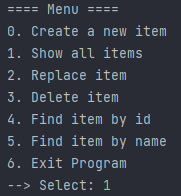

# Проект - Tracker

---
## О проекте

Проект представляет собой консольное приложение, систему заявок, которые хранятся в БД.
Исходный код проекта располагается в пакете ru.job4j.tracker. Возможно выполнять следующие действия с заявками:  
- cоздать новую (Create a new item),
- вывести все (Show all items),
- отредактировать (Replace item),
- удалить (Delete item),
- найти по id (Find item by id),
- найти по имени (Find item by name),
- выйти из программы (Exit).

Работа приложения показана ниже. 
  

## Сборка

Для сборки проекта необходимо:
1. Установить JDK 14, Maven.
2. Установить PostgreSQL, задать логин - postgres, пароль - password.
3. Скачать исходный код проекта с GitHub.
4. Перейти в папку, где лежит файл pom.xml.
5. Собрать проект командой `mvn -DskipTests=true package`.
6. Создать в pg_Admin БД tracker.
7. Открыть Query Tool и из папки db запустить create.sql.

## Использование

Когда jar-архив собран и БД подготовлена, можно запускать приложение из папки target командой  
`java -jar .\Tracker.jar`. После запуска из меню доступны все операции с заявками.  
  

## Контакты

[Telegram](https://t.me/Saimon494)